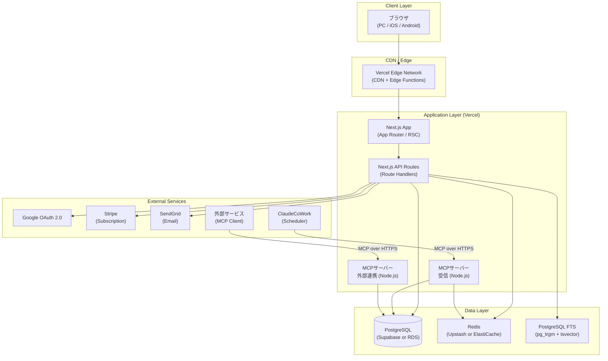
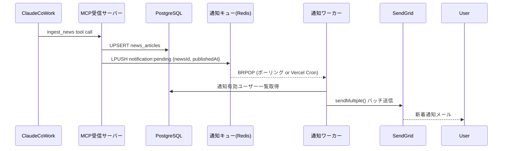
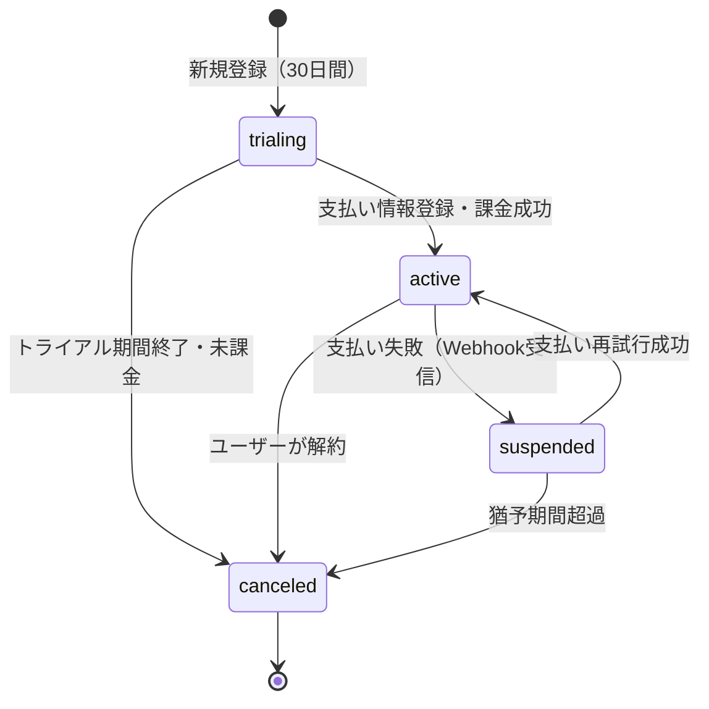
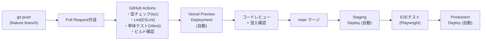

# 基本設計書

## プロジェクト情報

| 項目 | 内容 |
|------|------|
| プロジェクト名 | AI Insight Daily — CEO向けAIニュースキュレーションサービス |
| 作成日 | 2026-04-24 |
| バージョン | 1.0 |
| ステータス | ドラフト |
| 対応要件定義書 | 要件定義書.md v1.0 |

---

## 1. システムアーキテクチャ

### 1.1 全体構成図



### 1.2 技術スタック決定

| レイヤー | 採用技術 | バージョン | 選定理由 |
|---------|---------|-----------|---------|
| フロントエンド | Next.js (App Router) | 15.x | RSC・SSR・ISRを一元管理、Vercelとの相性最良 |
| UI言語 | React | 19.x | Next.js 15に同梱 |
| 型システム | TypeScript | 5.x | 全レイヤー型安全を確保 |
| CSSフレームワーク | Tailwind CSS | 4.x | ユーティリティファーストでレスポンシブ対応を効率化 |
| UIコンポーネント | shadcn/ui | latest | Radix UIベース、アクセシビリティ・デザイン品質確保 |
| チャート（管理画面） | Recharts | 2.x | React向け宣言的グラフライブラリ |
| バックエンドランタイム | Next.js Route Handlers | — | TypeScript統一、APIルートをモノレポで管理 |
| ORM | Prisma | 6.x | 型安全なDB操作・マイグレーション管理 |
| データベース | PostgreSQL | 16.x | FTS・JSONBカラム・UPSERT対応 |
| キャッシュ | Redis (Upstash) | — | Serverless対応、セッション・ニュースキャッシュ |
| 認証基盤 | NextAuth.js (Auth.js v5) | 5.x | Passkey・Google・Credentials対応、Next.js統合 |
| WebAuthn | SimpleWebAuthn | 10.x | FIDO2/WebAuthn実装ライブラリ |
| MCPサーバー | @modelcontextprotocol/sdk | latest | Anthropic公式TypeScript SDK |
| メール配信 | SendGrid (@sendgrid/mail) | — | テンプレート管理・配信レート制御 |
| 決済 | Stripe (stripe-js) | — | サブスクリプション・Webhook |
| バリデーション | Zod | 3.x | スキーマ駆動バリデーション、API入力検証 |
| テスト | Vitest + Testing Library | — | 単体・統合テスト |
| E2Eテスト | Playwright | — | クロスブラウザ・モバイル確認 |
| CI/CD | GitHub Actions + Vercel | — | PR毎プレビュー、main pushで本番デプロイ |
| インフラ | Vercel (App) + Supabase (DB) | — | 運用コスト最小・スケーラブル |

---

## 2. アプリケーション構成

### 2.1 ディレクトリ構成

```
ainews/
├── apps/
│   └── web/                          # Next.js アプリケーション
│       ├── app/                      # App Router
│       │   ├── (public)/             # 未認証ユーザー向けルート
│       │   │   ├── page.tsx          # SC-001: ランディングページ
│       │   │   ├── login/page.tsx    # SC-003: ログイン
│       │   │   └── register/page.tsx # SC-002: 新規登録
│       │   ├── (auth)/               # 認証済みユーザー向けルート（middleware保護）
│       │   │   ├── layout.tsx        # 認証チェック・サブスクリプション確認
│       │   │   ├── news/
│       │   │   │   ├── page.tsx      # SC-004: ホーム（日別ニュース）
│       │   │   │   ├── [date]/page.tsx # アーカイブ日別
│       │   │   │   └── monthly/
│       │   │   │       ├── page.tsx  # SC-005: 月別サマリ
│       │   │   │       └── [yearMonth]/page.tsx
│       │   │   ├── archive/page.tsx  # SC-006: アーカイブ検索
│       │   │   └── settings/page.tsx # SC-007: マイページ
│       │   ├── (admin)/              # 管理者専用ルート
│       │   │   ├── layout.tsx        # 管理者ロール確認
│       │   │   ├── dashboard/page.tsx # SC-008: ダッシュボード
│       │   │   ├── users/
│       │   │   │   ├── page.tsx      # SC-009: ユーザー一覧
│       │   │   │   └── [userId]/page.tsx
│       │   │   └── logs/page.tsx     # SC-010: アクセスログ
│       │   └── api/                  # Route Handlers
│       │       ├── auth/[...nextauth]/route.ts
│       │       ├── webauthn/
│       │       │   ├── register/
│       │       │   │   ├── options/route.ts
│       │       │   │   └── verify/route.ts
│       │       │   └── authenticate/
│       │       │       ├── options/route.ts
│       │       │       └── verify/route.ts
│       │       ├── news/
│       │       │   ├── daily/route.ts
│       │       │   ├── monthly/route.ts
│       │       │   └── archive/route.ts
│       │       ├── notifications/route.ts
│       │       ├── subscriptions/
│       │       │   ├── route.ts
│       │       │   └── webhook/route.ts  # Stripe Webhook
│       │       └── admin/
│       │           ├── users/route.ts
│       │           ├── users/[userId]/route.ts
│       │           └── logs/route.ts
│       ├── components/
│       │   ├── ui/                   # shadcn/ui ベースコンポーネント
│       │   ├── news/                 # ニュース関連コンポーネント
│       │   │   ├── NewsCard.tsx
│       │   │   ├── CeoInsightPanel.tsx
│       │   │   ├── NewsDateTabs.tsx
│       │   │   └── AiFilterBadge.tsx
│       │   ├── auth/                 # 認証フローコンポーネント
│       │   │   ├── PasskeyButton.tsx
│       │   │   ├── GoogleSignInButton.tsx
│       │   │   └── EmailPasswordForm.tsx
│       │   ├── admin/                # 管理画面コンポーネント
│       │   │   ├── KpiCard.tsx
│       │   │   ├── UserTable.tsx
│       │   │   └── AccessLogTable.tsx
│       │   └── layout/
│       │       ├── Header.tsx
│       │       ├── Sidebar.tsx
│       │       └── MobileNav.tsx
│       ├── lib/
│       │   ├── auth.ts               # Auth.js 設定
│       │   ├── prisma.ts             # Prismaクライアントシングルトン
│       │   ├── redis.ts              # Redisクライアント
│       │   ├── webauthn.ts           # SimpleWebAuthn ヘルパー
│       │   ├── stripe.ts             # Stripeクライアント
│       │   ├── sendgrid.ts           # SendGridクライアント
│       │   └── access-log.ts         # アクセスログ記録ユーティリティ
│       ├── types/
│       │   ├── api.ts                # APIレスポンス型
│       │   ├── news.ts               # ニュースドメイン型
│       │   └── admin.ts              # 管理者ドメイン型
│       ├── middleware.ts             # 認証・サブスクリプション保護
│       └── prisma/
│           └── schema.prisma
├── apps/
│   └── mcp/                          # MCPサーバー（独立Node.jsプロセス）
│       ├── src/
│       │   ├── server-ingest.ts      # 受信MCPサーバー（ClaudeCoWork連携）
│       │   ├── server-export.ts      # 外部連携MCPサーバー
│       │   ├── tools/
│       │   │   ├── ingest-news.ts
│       │   │   ├── get-daily-news.ts
│       │   │   └── get-monthly-summary.ts
│       │   └── auth/
│       │       └── api-key.ts        # APIキー検証ミドルウェア
│       └── package.json
└── packages/
    └── db/                           # 共有Prismaスキーマ・マイグレーション
        ├── prisma/schema.prisma
        └── src/index.ts
```

### 2.2 Next.js ルーティング設計

| パス | ルートグループ | 認証 | コンポーネント |
|------|-------------|------|--------------|
| `/` | (public) | 不要 | ランディング。未認証時はニュース冒頭のみティーザー表示 |
| `/login` | (public) | 不要 | ログイン選択画面 |
| `/register` | (public) | 不要 | 新規登録フロー |
| `/news` | (auth) | 必要 | 本日の日別ニュース（デフォルト表示） |
| `/news/[date]` | (auth) | 必要 | 指定日のニュース（YYYY-MM-DD） |
| `/news/monthly` | (auth) | 必要 | 当月の月別サマリ |
| `/news/monthly/[yearMonth]` | (auth) | 必要 | 指定月サマリ（YYYY-MM） |
| `/archive` | (auth) | 必要 | アーカイブ検索・閲覧 |
| `/settings` | (auth) | 必要 | マイページ・設定 |
| `/admin/dashboard` | (admin) | 管理者のみ | KPIダッシュボード |
| `/admin/users` | (admin) | 管理者のみ | ユーザー管理 |
| `/admin/logs` | (admin) | 管理者のみ | アクセスログ |

### 2.3 middleware.ts 設計

```typescript
// middleware.ts の制御フロー
export const config = {
  matcher: ['/((?!_next|api/auth|api/webauthn).*)'],
}

// 判定順序:
// 1. /admin/* → role === 'ADMIN' でなければ /news へリダイレクト
// 2. /(auth)/* → 未認証なら /login へリダイレクト
// 3. /(auth)/* → subscription_status が 'active' | 'trialing' でなければ /settings へリダイレクト
// 4. アクセスログをEdge経由で非同期記録（レスポンスを遅延させない）
```

---

## 3. 画面設計

### 3.1 画面一覧と主要コンポーネント

#### SC-001: ランディングページ（`/`）

```
┌─────────────────────────────────────────────┐
│  [ロゴ]  AI Insight Daily    [ログイン] [登録] │  ← Header（sticky）
├─────────────────────────────────────────────┤
│  Hero: 「CEOの朝を変える、AIニュース」        │
│  [30日間無料で始める]  [デモを見る]           │
├─────────────────────────────────────────────┤
│  ── 本日のニュースプレビュー（ティーザー） ──  │
│  ┌──────────┐  ┌──────────┐  ┌──────────┐  │
│  │ Claude   │  │ ChatGPT  │  │ Gemini   │  │
│  │ ████████ │  │ ████████ │  │ ████████ │  │
│  │ [続きは  │  │ [続きは  │  │ [続きは  │  │
│  │  ログイン│  │  ログイン│  │  ログイン│  │
│  │  後]     │  │  後]     │  │  後]     │  │
│  └──────────┘  └──────────┘  └──────────┘  │
└─────────────────────────────────────────────┘
```

**主要コンポーネント:** `Header`, `HeroSection`, `NewsTeaser`（ブラーオーバーレイ付き）

---

#### SC-003: ログイン画面（`/login`）

```
┌─────────────────────────────────┐
│         AI Insight Daily        │
│                                 │
│  ┌─────────────────────────┐    │
│  │ 🔑  パスキーでログイン   │    │  ← 最上位表示（推奨）
│  └─────────────────────────┘    │
│  ┌─────────────────────────┐    │
│  │ G   Googleでログイン    │    │
│  └─────────────────────────┘    │
│                                 │
│  ─────── または ───────         │
│  メールアドレス: [          ]    │
│  パスワード:     [          ]    │
│                    [ログイン]    │
│                                 │
│  アカウントをお持ちでない方→[登録] │
└─────────────────────────────────┘
```

---

#### SC-004: ホーム（日別ニュースメイン）（`/news`）

```
┌──────────────────────────────────────────────────────────┐
│ [ロゴ]  [ニュース▼] [アーカイブ] [設定]    [アバター▼]    │  Header
├────────────┬─────────────────────────────────────────────┤
│            │  [本日 4/24] [昨日 4/23]                     │  ← 日付タブ
│  サイドバー │─────────────────────────────────────────────│
│            │  ┌──────────────────────────────────────┐   │
│  ■ 本日    │  │ 🔵 Claude                             │   │
│  ■ 昨日    │  │ タイトル: ○○○○○                       │   │
│            │  │ 要約: ████████████████████            │   │
│  AI フィルタ│  │ ──────────────────────────────────── │   │
│  ☑ Claude  │  │ 💡 CEO向け経営示唆                    │   │
│  ☑ ChatGPT │  │ ████████████████████████████         │   │
│  ☑ Gemini  │  └──────────────────────────────────────┘   │
│  ☑ その他  │  ┌──────────────────────────────────────┐   │
│            │  │ 🟢 ChatGPT                            │   │
│            │  │  ....（以下繰り返し）                  │   │
│            │  └──────────────────────────────────────┘   │
└────────────┴─────────────────────────────────────────────┘

モバイル時: サイドバーは上部ドロワー / フィルタはボトムシート
```

**レンダリング戦略:** ISR（revalidate: 600秒）。最新ニュースはMCP受信後にオンデマンドrevalidation。

---

#### SC-005: 月別サマリ（`/news/monthly`）

```
┌──────────────────────────────────────────────────────────┐
│  [< 2026年3月]  2026年4月 月次AIトレンドサマリ  [5月 >]  │
├──────────────────────────────────────────────────────────┤
│  月間ハイライト                                           │
│  ████████████████████████████████████████████           │
├───────────────────────────┬──────────────────────────────┤
│  AI別トピック              │  CEO向け月次示唆              │
│  Claude: ████████         │  ・████████████              │
│  ChatGPT: ████████        │  ・████████████              │
│  Gemini: ████████         │  ・████████████              │
└───────────────────────────┴──────────────────────────────┘
```

---

#### SC-006: アーカイブ検索（`/archive`）

```
┌──────────────────────────────────────────────────────────┐
│  期間: [2026/01/01] ～ [2026/04/24]                       │
│  AI: [Claude ▼] [ChatGPT ▼] [Gemini ▼] [すべて]         │
│  キーワード: [                    ] [検索]                │
├──────────────────────────────────────────────────────────┤
│  検索結果: 245件                                          │
│  ┌──────────────────────────────────────────────────┐   │
│  │ 2026-04-10 │ Claude │ タイトル...           [>] │   │
│  ├──────────────────────────────────────────────────┤   │
│  │ 2026-04-09 │ Gemini │ タイトル...           [>] │   │
│  └──────────────────────────────────────────────────┘   │
│  [1] [2] [3] ... [次へ >]                                 │
└──────────────────────────────────────────────────────────┘
```

**検索実装:** PostgreSQL `tsvector` + `pg_trgm` による全文検索。日本語対応は `pgroonga` 拡張を推奨。

---

#### SC-008: 管理者ダッシュボード（`/admin/dashboard`）

```
┌──────────────────────────────────────────────────────────┐
│  ┌──────────┐ ┌──────────┐ ┌──────────┐ ┌──────────┐   │
│  │ 総ユーザー│ │アクティブ │ │ トライアル│ │ 解約率   │   │  ← KPIカード
│  │  1,234   │ │  892     │ │  156     │ │  2.3%    │   │
│  └──────────┘ └──────────┘ └──────────┘ └──────────┘   │
├───────────────────────────┬──────────────────────────────┤
│  DAU（日次アクティブ推移） │  AI別閲覧数（先月比）        │
│  [折れ線グラフ]            │  [棒グラフ]                  │
├───────────────────────────┴──────────────────────────────┤
│  最近のアクセスログ（直近20件）                           │
│  ユーザー | 操作 | 日時 | IP                              │
└──────────────────────────────────────────────────────────┘
```

---

### 3.2 レスポンシブブレークポイント

| ブレークポイント | Tailwind | 対象デバイス | レイアウト変更内容 |
|----------------|----------|------------|-----------------|
| < 768px | `default` | スマートフォン | サイドバー非表示→ドロワー。1カラム表示 |
| 768px〜 | `md:` | タブレット | 2カラム（サイドバー折りたたみ） |
| 1024px〜 | `lg:` | PC | 3カラム全表示 |

---

## 4. API設計

### 4.1 API一覧

| メソッド | パス | 認証 | 概要 |
|---------|------|------|------|
| GET | `/api/news/daily` | JWT | 本日・昨日のニュース取得 |
| GET | `/api/news/daily/[date]` | JWT | 指定日ニュース取得 |
| GET | `/api/news/monthly` | JWT | 当月サマリ取得 |
| GET | `/api/news/monthly/[yearMonth]` | JWT | 指定月サマリ取得 |
| GET | `/api/news/archive` | JWT | アーカイブ検索 |
| POST | `/api/auth/[...nextauth]` | — | Auth.js 認証エンドポイント |
| POST | `/api/webauthn/register/options` | JWT | WebAuthn登録チャレンジ生成 |
| POST | `/api/webauthn/register/verify` | JWT | WebAuthn登録検証 |
| POST | `/api/webauthn/authenticate/options` | — | WebAuthn認証チャレンジ生成 |
| POST | `/api/webauthn/authenticate/verify` | — | WebAuthn認証検証・JWT発行 |
| GET | `/api/notifications` | JWT | 通知設定取得 |
| PUT | `/api/notifications` | JWT | 通知設定変更 |
| GET | `/api/subscriptions` | JWT | サブスクリプション状態取得 |
| POST | `/api/subscriptions/webhook` | Stripe署名 | Stripe Webhook受信 |
| GET | `/api/admin/users` | JWT+Admin | ユーザー一覧取得 |
| GET | `/api/admin/users/[userId]` | JWT+Admin | ユーザー詳細取得 |
| PATCH | `/api/admin/users/[userId]` | JWT+Admin | ユーザー更新（停止・権限変更） |
| DELETE | `/api/admin/users/[userId]` | JWT+Admin | ユーザー削除 |
| GET | `/api/admin/logs` | JWT+Admin | アクセスログ取得・CSV出力 |

### 4.2 主要APIスキーマ（Zodで定義）

#### GET `/api/news/daily` レスポンス

```typescript
// types/api.ts
export const DailyNewsResponseSchema = z.object({
  date: z.string(), // "2026-04-24"
  articles: z.array(z.object({
    id: z.string().uuid(),
    aiName: z.enum(['Claude', 'ChatGPT', 'Gemini', 'Other']),
    title: z.string(),
    summary: z.string(),
    ceoInsight: z.string(),
    sourceUrls: z.array(z.string().url()),
    publishedAt: z.string().datetime(),
  })),
})

export type DailyNewsResponse = z.infer<typeof DailyNewsResponseSchema>
```

#### GET `/api/news/archive` クエリパラメータ

```typescript
export const ArchiveQuerySchema = z.object({
  from: z.string().date(),               // "2021-01-01"
  to: z.string().date(),                 // "2026-04-24"
  aiFilter: z.array(z.string()).optional(),
  keyword: z.string().max(100).optional(),
  page: z.coerce.number().int().min(1).default(1),
  pageSize: z.coerce.number().int().min(1).max(50).default(20),
  type: z.enum(['daily', 'monthly', 'all']).default('all'),
})
```

#### PATCH `/api/admin/users/[userId]` リクエスト

```typescript
export const UpdateUserSchema = z.object({
  status: z.enum(['active', 'suspended']).optional(),
  role: z.enum(['USER', 'ADMIN']).optional(),
  subscriptionStatus: z.enum(['active', 'trialing', 'canceled', 'suspended']).optional(),
})
```

### 4.3 エラーレスポンス共通フォーマット

```typescript
// 全APIエンドポイントで共通
interface ApiErrorResponse {
  error: {
    code: string      // "UNAUTHORIZED" | "FORBIDDEN" | "NOT_FOUND" | "VALIDATION_ERROR" | "INTERNAL_ERROR"
    message: string   // 日本語エラーメッセージ
    details?: unknown // Zodバリデーションエラー詳細など
  }
}
```

---

## 5. 認証設計

### 5.1 認証フロー全体図

```mermaid
flowchart TD
  Start([アクセス]) --> HasSession{セッションあり?}
  HasSession -->|Yes| CheckSub{サブスク有効?}
  HasSession -->|No| LoginPage[ログイン画面]

  LoginPage --> ChooseMethod{認証方法選択}
  ChooseMethod --> Passkey[パスキー認証]
  ChooseMethod --> Google[Google OAuth]
  ChooseMethod --> EmailPW[Email/PW認証]

  Passkey --> WebAuthnChallenge[チャレンジ生成\n/api/webauthn/authenticate/options]
  WebAuthnChallenge --> DeviceAuth[デバイス生体認証\nTouch ID / Face ID]
  DeviceAuth --> WebAuthnVerify[署名検証\n/api/webauthn/authenticate/verify]
  WebAuthnVerify --> IssueJWT[JWT発行・Cookieセット]

  Google --> OAuthRedirect[Google認証画面]
  OAuthRedirect --> OAuthCallback[/api/auth/callback/google]
  OAuthCallback --> IssueJWT

  EmailPW --> VerifyPW[bcrypt照合]
  VerifyPW --> IssueJWT

  IssueJWT --> CheckSub
  CheckSub -->|有効| NewsHome[/news]
  CheckSub -->|無効/期限切れ| SettingsPage[/settings\n課金案内]
```

### 5.2 Auth.js (NextAuth v5) 設定方針

```typescript
// lib/auth.ts の設計概要
export const authConfig = {
  providers: [
    Google({
      clientId: process.env.GOOGLE_CLIENT_ID,
      clientSecret: process.env.GOOGLE_CLIENT_SECRET,
    }),
    Credentials({
      // Email/PW認証
      async authorize(credentials) {
        // Zodバリデーション → DB照合 → bcrypt.compare
      },
    }),
    // WebAuthnはAuth.jsのWebAuthn providerまたはカスタムCredentialsで実装
  ],
  callbacks: {
    async jwt({ token, user }) {
      // role, subscriptionStatus をトークンに埋め込む
    },
    async session({ session, token }) {
      // フロントに渡すセッション情報を制御
    },
  },
  session: { strategy: 'jwt', maxAge: 24 * 60 * 60 }, // 24時間
}
```

### 5.3 パスキー（WebAuthn/FIDO2）フロー

#### 登録フロー（初回パスキー登録）

```
Client                          Server
  |                               |
  |-- POST /webauthn/register/options -->|
  |                               | generateRegistrationOptions()
  |<-- { challenge, rpId, ... } --|
  |                               |
  | [デバイス生体認証]              |
  |                               |
  |-- POST /webauthn/register/verify -->|
  |   { credential }              | verifyRegistrationResponse()
  |                               | DB: passkeys テーブルに保存
  |<-- { success: true } ---------|
```

#### 認証フロー

```
Client                          Server
  |                               |
  |-- POST /webauthn/authenticate/options -->|
  |   { email? }                  | generateAuthenticationOptions()
  |<-- { challenge, allowCredentials } --|
  |                               |
  | [デバイス生体認証]              |
  |                               |
  |-- POST /webauthn/authenticate/verify -->|
  |   { credential }              | verifyAuthenticationResponse()
  |                               | DB: passkeys.last_used_at 更新
  |<-- Set-Cookie: next-auth.session-token |
```

### 5.4 サブスクリプション状態と権限マトリクス

| ユーザー状態 | 未認証 | トライアル中 | 有効サブスク | 期限切れ | 管理者 |
|------------|--------|------------|------------|---------|-------|
| ランディングページ | ○ | ○ | ○ | ○ | ○ |
| ニュースティーザー | ○ | ○ | ○ | ○ | ○ |
| ニュース全文 | ✗ | ○ | ○ | ✗ | ○ |
| 月別サマリ | ✗ | ○ | ○ | ✗ | ○ |
| アーカイブ | ✗ | ○ | ○ | ✗ | ○ |
| マイページ | ✗ | ○ | ○ | ○ | ○ |
| 管理者画面 | ✗ | ✗ | ✗ | ✗ | ○ |

---

## 6. データベース設計

### 6.1 ER図

```mermaid
erDiagram
  users {
    uuid id PK
    varchar email UK
    varchar display_name
    varchar password_hash "nullable"
    user_role role "USER | ADMIN"
    subscription_status subscription_status
    timestamp trial_end_date
    timestamp created_at
    timestamp updated_at
    timestamp deleted_at "soft delete"
  }

  accounts {
    uuid id PK
    uuid user_id FK
    varchar provider "google | credentials"
    varchar provider_account_id
    timestamp created_at
  }

  passkeys {
    uuid id PK
    uuid user_id FK
    varchar credential_id UK
    text public_key
    bigint counter
    varchar aaguid
    varchar device_name "nullable (ユーザー設定名)"
    timestamp created_at
    timestamp last_used_at
  }

  subscriptions {
    uuid id PK
    uuid user_id FK
    varchar stripe_subscription_id UK "nullable"
    varchar stripe_customer_id
    varchar plan_id
    subscription_status status
    timestamp trial_start_date
    timestamp trial_end_date
    timestamp current_period_end
    timestamp created_at
    timestamp updated_at
  }

  news_articles {
    uuid id PK
    date news_date
    news_type type "daily | monthly_summary"
    varchar ai_name
    text title
    text summary
    text ceo_insight
    jsonb source_urls
    timestamp published_at
    timestamp created_at
    timestamp expires_at "5年後"
  }

  monthly_reports {
    uuid id PK
    char year_month "YYYY-MM"
    text summary_text
    jsonb key_events
    text ceo_insight
    timestamp published_at
    timestamp created_at
  }

  notification_settings {
    uuid user_id PK FK
    boolean email_enabled
    notification_frequency frequency "realtime | daily_digest"
    timestamp updated_at
  }

  access_logs {
    uuid id PK
    uuid user_id FK "nullable (未認証)"
    varchar action_type
    uuid article_id FK "nullable"
    inet ip_address
    text user_agent
    timestamp accessed_at
  }

  admin_audit_logs {
    uuid id PK
    uuid admin_user_id FK
    varchar action
    uuid target_user_id FK "nullable"
    jsonb detail
    timestamp performed_at
  }

  users ||--o{ accounts : "has"
  users ||--o{ passkeys : "has"
  users ||--o| subscriptions : "has"
  users ||--o| notification_settings : "has"
  users ||--o{ access_logs : "generates"
  users ||--o{ admin_audit_logs : "performs"
  news_articles ||--o{ access_logs : "referenced by"
```

### 6.2 Prismaスキーマ（主要テーブル抜粋）

```prisma
// prisma/schema.prisma

generator client {
  provider = "prisma-client-js"
}

datasource db {
  provider = "postgresql"
  url      = env("DATABASE_URL")
}

enum UserRole {
  USER
  ADMIN
}

enum SubscriptionStatus {
  trialing
  active
  canceled
  suspended
}

enum NewsType {
  daily
  monthly_summary
}

model User {
  id               String             @id @default(uuid())
  email            String             @unique
  displayName      String?
  passwordHash     String?
  role             UserRole           @default(USER)
  subscriptionStatus SubscriptionStatus @default(trialing)
  trialEndDate     DateTime?
  createdAt        DateTime           @default(now())
  updatedAt        DateTime           @updatedAt
  deletedAt        DateTime?

  accounts         Account[]
  passkeys         Passkey[]
  subscription     Subscription?
  notificationSetting NotificationSetting?
  accessLogs       AccessLog[]
  adminAuditLogs   AdminAuditLog[]

  @@map("users")
}

model Passkey {
  id           String   @id @default(uuid())
  userId       String
  credentialId String   @unique
  publicKey    String
  counter      BigInt   @default(0)
  aaguid       String?
  deviceName   String?
  createdAt    DateTime @default(now())
  lastUsedAt   DateTime?

  user         User     @relation(fields: [userId], references: [id], onDelete: Cascade)

  @@map("passkeys")
}

model NewsArticle {
  id          String    @id @default(uuid())
  newsDate    DateTime  @db.Date
  type        NewsType
  aiName      String
  title       String
  summary     String
  ceoInsight  String
  sourceUrls  Json      @default("[]")
  publishedAt DateTime
  createdAt   DateTime  @default(now())
  expiresAt   DateTime  // 5年後の日時をAPP側でセット

  accessLogs  AccessLog[]

  @@index([newsDate, type])
  @@index([aiName])
  @@index([publishedAt])
  @@map("news_articles")
}

model AccessLog {
  id          String    @id @default(uuid())
  userId      String?
  actionType  String    // "view_news" | "login" | "search" | etc.
  articleId   String?
  ipAddress   String?
  userAgent   String?
  accessedAt  DateTime  @default(now())

  user        User?         @relation(fields: [userId], references: [id])
  article     NewsArticle?  @relation(fields: [articleId], references: [id])

  @@index([userId, accessedAt])
  @@index([accessedAt])
  @@map("access_logs")
}
```

### 6.3 インデックス設計

| テーブル | インデックス | 用途 |
|---------|------------|------|
| news_articles | `(news_date, type)` | 日別ニュース取得 |
| news_articles | `ai_name` | AIフィルタ検索 |
| news_articles | `published_at DESC` | 新着順並び替え |
| news_articles | `to_tsvector('japanese', title \|\| summary)` | 全文検索（GINインデックス） |
| access_logs | `(user_id, accessed_at DESC)` | ユーザー別ログ取得 |
| access_logs | `accessed_at DESC` | 管理者ログ閲覧 |
| passkeys | `credential_id` | WebAuthn認証時の高速照合 |

### 6.4 全文検索設計

アーカイブ検索（F-003）はPostgreSQLのネイティブFTSを使用する。

```sql
-- マイグレーションで追加
ALTER TABLE news_articles
  ADD COLUMN search_vector tsvector
  GENERATED ALWAYS AS (
    to_tsvector('simple', coalesce(title, '') || ' ' || coalesce(summary, ''))
  ) STORED;

CREATE INDEX idx_news_articles_search
  ON news_articles USING GIN(search_vector);

-- 検索クエリ例（Prisma rawクエリ）
SELECT * FROM news_articles
WHERE search_vector @@ plainto_tsquery('simple', $1)
  AND news_date BETWEEN $2 AND $3
ORDER BY ts_rank(search_vector, plainto_tsquery('simple', $1)) DESC
LIMIT 20 OFFSET $4;
```

> 日本語の形態素解析が必要な場合は `pgroonga` 拡張を追加導入する。

---

## 7. MCPサーバー設計

### 7.1 受信MCPサーバー（ClaudeCoWork連携）

**実装方式:** `@modelcontextprotocol/sdk` の `McpServer` + Streamable HTTP Transport

```typescript
// apps/mcp/src/server-ingest.ts

import { McpServer } from '@modelcontextprotocol/sdk/server/mcp.js'
import { StreamableHTTPServerTransport } from '@modelcontextprotocol/sdk/server/streamableHttp.js'
import { z } from 'zod'

const server = new McpServer({
  name: 'ainews-ingest',
  version: '1.0.0',
})

const ArticleSchema = z.object({
  aiName: z.string(),
  title: z.string(),
  summary: z.string(),
  ceoInsight: z.string(),
  sourceUrls: z.array(z.string().url()),
  publishedAt: z.string().datetime(),
})

server.tool(
  'ingest_news',
  'AIニュース記事をDBに格納する（ClaudeCoWork専用）',
  {
    newsDate: z.string().date(),
    newsType: z.enum(['daily', 'monthly_summary']),
    articles: z.array(ArticleSchema).min(1).max(50),
    monthlySummary: z.string().optional(),
  },
  async ({ newsDate, newsType, articles, monthlySummary }) => {
    // UPSERT処理（冪等性確保）
    // DB格納後、Redisキャッシュをパージ
    // 新着ニュース通知キューへ追加
    // Revalidation Tokenを使ってNext.jsのISRキャッシュを破棄
    return { content: [{ type: 'text', text: `Ingested ${articles.length} articles.` }] }
  }
)
```

**エンドポイント:** `POST /mcp/ingest`

**セキュリティ:**
- リクエストヘッダー `X-API-Key` でAPIキー検証（環境変数 `MCP_INGEST_API_KEY`）
- IPホワイトリスト制限（ClaudeCoWorkの送信元IP）
- レート制限: 1分あたり10リクエスト

---

### 7.2 外部連携MCPサーバー

**エンドポイント:** `POST /mcp/export`

```typescript
// apps/mcp/src/server-export.ts

server.tool(
  'get_daily_news',
  '指定日のAIニュース一覧を取得する',
  {
    date: z.string().date(),
    aiFilter: z.array(z.string()).optional(),
  },
  async ({ date, aiFilter }) => {
    // DBからニュース取得（Redisキャッシュ優先）
    // APIキー所有者のアクセスログ記録
  }
)

server.tool(
  'get_monthly_summary',
  '指定月のAIニュースサマリを取得する',
  {
    yearMonth: z.string().regex(/^\d{4}-\d{2}$/),
  },
  async ({ yearMonth }) => {
    // monthly_reports テーブルから取得
  }
)

server.tool(
  'search_news_archive',
  'キーワードと期間でニュースアーカイブを検索する',
  {
    keyword: z.string().max(100),
    from: z.string().date(),
    to: z.string().date(),
    aiFilter: z.array(z.string()).optional(),
    limit: z.number().int().min(1).max(50).default(20),
  },
  async (params) => { /* FTS検索 */ }
)
```

**セキュリティ:** `X-API-Key` ヘッダーによるAPIキー認証。APIキーはDBで管理し、クライアント別に発行。

---

## 8. メール通知設計

### 8.1 通知フロー



### 8.2 メールテンプレート設計

**件名:** `【AI Insight Daily】本日のAIニュースが更新されました（{date}）`

**本文構成（SendGridダイナミックテンプレート）:**
```
─────────────────────────────
AI Insight Daily  {date}
─────────────────────────────

本日のAI注目ニュース

▶ Claude  {title}
  {summary_excerpt}

▶ ChatGPT  {title}
  {summary_excerpt}

💡 CEO向け今日の示唆
  {ceo_insight_excerpt}

続きはこちら → {app_url}/news

─────────────────────────────
配信停止はこちら → {unsubscribe_url}
```

### 8.3 通知ワーカー実装方針

Vercel Cron Jobs（`vercel.json`に定義）で5分毎に `POST /api/internal/notify-worker` を呼び出す。ワーカーはRedisキューを消費してSendGridに送信する。

```json
// vercel.json
{
  "crons": [
    {
      "path": "/api/internal/notify-worker",
      "schedule": "*/5 * * * *"
    }
  ]
}
```

---

## 9. Stripe サブスクリプション設計

### 9.1 サブスクリプションライフサイクル



### 9.2 Stripe Webhook処理（`/api/subscriptions/webhook`）

| Stripeイベント | 処理内容 |
|------------|---------|
| `checkout.session.completed` | `subscription_status` を `active` に更新 |
| `customer.subscription.trial_will_end` | 3日前通知メール送信 |
| `invoice.payment_failed` | `subscription_status` を `suspended` に更新 |
| `customer.subscription.deleted` | `subscription_status` を `canceled` に更新 |
| `customer.subscription.updated` | プラン変更・期間更新を同期 |

---

## 10. キャッシュ設計

### 10.1 Redisキャッシュ方針

| キャッシュキー | TTL | 内容 | 無効化タイミング |
|------------|-----|------|--------------|
| `news:daily:{date}` | 10分 | 日別ニュース全件 | MCP受信後パージ |
| `news:monthly:{yearMonth}` | 1時間 | 月別サマリ | MCP受信後パージ |
| `session:{userId}` | 24時間 | セッション情報 | ログアウト時パージ |
| `webauthn:challenge:{sessionId}` | 5分 | WebAuthnチャレンジ | 検証後即削除 |
| `rate_limit:mcp:{ip}` | 60秒 | MCPレート制限カウンタ | 自然失効 |
| `notification:pending` | — | 通知キュー（Listデータ構造） | ワーカーがPOP |

### 10.2 Next.js ISRキャッシュ

| ページ | revalidate | キャッシュ戦略 |
|-------|-----------|-------------|
| `/news` | 600秒 + オンデマンド | MCP受信時に `revalidatePath('/news')` 実行 |
| `/news/[date]` | 3600秒 | 過去記事は静的に近い扱い |
| `/news/monthly` | 3600秒 + オンデマンド | 月次更新時にrevalidate |
| `/` (ランディング) | 86400秒 | 静的コンテンツ |

---

## 11. セキュリティ設計

### 11.1 認証・認可

- **JWT有効期限:** 24時間。リフレッシュトークンは不使用（Auth.jsのセッション管理に委任）
- **パスキーチャレンジ:** Redisに5分間のみ保存し、検証後即削除
- **Adminルート保護:** `middleware.ts` でDB照合済みのroleトークンを検証。トークン偽造不可（HMAC署名）

### 11.2 入力バリデーション

全APIエンドポイントで**Zodスキーマによるリクエスト検証**を実施。不正な入力は400エラーで早期リターン。

```typescript
// Route Handlerの共通パターン
export async function POST(req: Request) {
  const body = await req.json()
  const result = SomeInputSchema.safeParse(body)
  if (!result.success) {
    return NextResponse.json(
      { error: { code: 'VALIDATION_ERROR', message: '入力値が不正です', details: result.error.flatten() } },
      { status: 400 }
    )
  }
  // 処理続行
}
```

### 11.3 CSRFとセキュリティヘッダー

```typescript
// next.config.ts
const securityHeaders = [
  { key: 'X-Frame-Options', value: 'DENY' },
  { key: 'X-Content-Type-Options', value: 'nosniff' },
  { key: 'Referrer-Policy', value: 'strict-origin-when-cross-origin' },
  { key: 'Permissions-Policy', value: 'camera=(), microphone=(), geolocation=()' },
  {
    key: 'Content-Security-Policy',
    value: [
      "default-src 'self'",
      "script-src 'self' 'unsafe-inline'",  // Next.js要件
      "style-src 'self' 'unsafe-inline'",
      "img-src 'self' data: https:",
      "connect-src 'self' https://api.stripe.com",
    ].join('; '),
  },
]
```

Auth.jsはデフォルトでCSRFトークンを使用する（`sameSite: 'lax'` Cookie）。

### 11.4 個人情報保護

- メールアドレスはDBに平文保存するが、バックアップファイルは暗号化
- パスワードは bcrypt（cost: 12）でハッシュ化
- ログにパスワード・クレジットカード情報を出力しない
- 退会後30日でユーザーデータ物理削除（soft deleteから30日のバッチ処理）

---

## 12. インフラ・デプロイ設計

### 12.1 環境構成

| 環境 | 用途 | ホスト |
|------|------|--------|
| ローカル | 開発 | `localhost:3000` + Dockerコンテナ（PG+Redis） |
| Preview | PRプレビュー（自動作成） | Vercel Preview URL |
| Staging | 受入テスト | `staging.ainews.example.com` (Vercel) |
| Production | 本番 | `ainews.example.com` (Vercel) |

### 12.2 CI/CDパイプライン



### 12.3 環境変数一覧

| 変数名 | 説明 | 必須 |
|--------|------|------|
| `DATABASE_URL` | PostgreSQL接続文字列 | ○ |
| `REDIS_URL` | Redis接続URL | ○ |
| `NEXTAUTH_SECRET` | Auth.js署名鍵（32文字以上ランダム） | ○ |
| `NEXTAUTH_URL` | アプリのベースURL | ○ |
| `GOOGLE_CLIENT_ID` | Google OAuth クライアントID | ○ |
| `GOOGLE_CLIENT_SECRET` | Google OAuth シークレット | ○ |
| `STRIPE_SECRET_KEY` | Stripe秘密鍵 | ○ |
| `STRIPE_WEBHOOK_SECRET` | Stripe Webhookシークレット | ○ |
| `SENDGRID_API_KEY` | SendGrid APIキー | ○ |
| `SENDGRID_FROM_EMAIL` | 送信者メールアドレス | ○ |
| `MCP_INGEST_API_KEY` | MCP受信サーバーAPIキー | ○ |
| `WEBAUTHN_RP_ID` | WebAuthn Relying Party ID（ドメイン名） | ○ |
| `WEBAUTHN_RP_NAME` | WebAuthn サービス表示名 | ○ |
| `NEXT_REVALIDATE_TOKEN` | ISRオンデマンドrevalidate用トークン | ○ |
| `INTERNAL_CRON_SECRET` | Vercel Cron Jobs認証シークレット | ○ |

---

## 13. テスト設計

### 13.1 テスト方針

| テスト種別 | ツール | 対象 | カバレッジ目標 |
|----------|-------|------|------------|
| 単体テスト | Vitest | ユーティリティ関数・Zodスキーマ・Prismaクエリ | 主要関数80%+ |
| 統合テスト | Vitest + Supertest | Route Handlers (API) | 全エンドポイント |
| コンポーネントテスト | Testing Library | Reactコンポーネント | 主要コンポーネント |
| E2Eテスト | Playwright | 主要シナリオ（認証・閲覧・管理） | ゴールデンパス |

### 13.2 主要E2Eシナリオ

| シナリオID | シナリオ名 | 検証内容 |
|----------|----------|---------|
| E2E-001 | 新規登録〜ニュース閲覧 | Google登録 → ホーム表示 → ニュース全文閲覧 |
| E2E-002 | パスキー登録〜ログイン | パスキー追加 → ログアウト → パスキーログイン |
| E2E-003 | トライアル期限切れ | trial_end_date を過去に設定 → ログイン後に設定ページへリダイレクト確認 |
| E2E-004 | アーカイブ検索 | キーワード入力 → 検索結果表示 → 記事遷移 |
| E2E-005 | 管理者操作 | 管理者ログイン → ダッシュボード表示 → ユーザー停止 |
| E2E-006 | MCP受信 | MCPエンドポイントへPOST → DB格納 → /newsのISRキャッシュ更新確認 |
| E2E-007 | モバイル表示 | iPhoneビューポートで全画面の表示崩れがないこと |

---

## 14. ログ・監視設計

### 14.1 ログ種別と出力先

| ログ種別 | 出力先 | フォーマット | 保持期間 |
|---------|-------|-----------|---------|
| アプリケーションログ | Vercel Log Drain → 外部ログサービス | JSON（構造化） | 90日 |
| アクセスログ | PostgreSQL access_logs テーブル | DB行 | 1年 |
| 認証ログ | PostgreSQL admin_audit_logs テーブル | DB行 | 2年 |
| MCPアクセスログ | アプリケーションログ + DB | JSON | 1年 |
| エラーログ | Sentry（推奨） | スタックトレース付き | 90日 |

### 14.2 アクセスログ記録の実装方針

```typescript
// lib/access-log.ts
export async function logAccess(params: {
  userId?: string
  actionType: 'view_news' | 'view_archive' | 'login' | 'logout' | 'search' | 'admin_action'
  articleId?: string
  req: Request
}): Promise<void> {
  // Edge Middlewareではなく、Route Handler内で非同期（fire-and-forget）で記録
  // レスポンスを遅延させないため await しない
  void prisma.accessLog.create({ data: { ...params, accessedAt: new Date() } })
    .catch(err => console.error('access-log write failed', err))
}
```

---

## 15. 変更履歴

| バージョン | 日付 | 変更者 | 変更内容 |
|-----------|------|--------|---------|
| 1.0 | 2026-04-24 | Claude (AI) | 初版作成（要件定義書 v1.0 より） |
