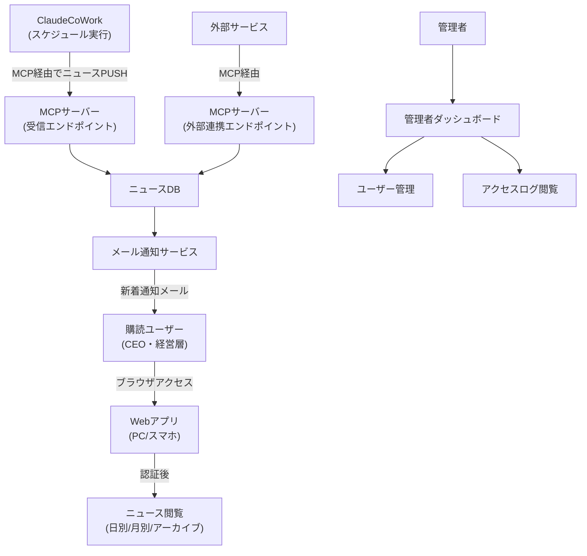
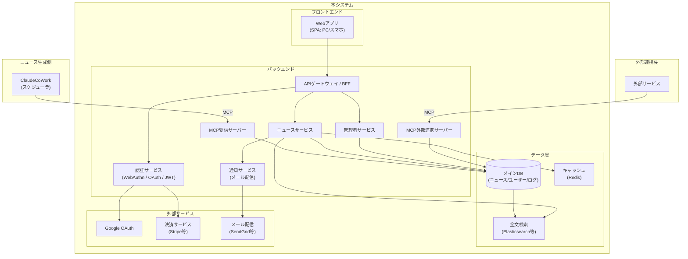

# 要件定義書

## プロジェクト情報

| 項目 | 内容 |
|------|------|
| プロジェクト名 | AI Insight Daily — CEO向けAIニュースキュレーションサービス |
| 作成日 | 2026-04-24 |
| バージョン | 1.0 |
| ステータス | ドラフト |

---

## 1. プロジェクト概要

### 1.1 目的・背景

ChatGPT・Claude・Geminiをはじめとする主要AIの動向は急速に変化しており、経営者が毎日情報収集するには相当な時間コストがかかる。本サービスは、AIが自動収集・要約した最新AIニュースと、CEO・経営層が意思決定に活用できる「経営示唆」をワンスクリーンで提供する有料キュレーションサービスである。

ニュース生成はClaudeCoWorkのスケジュール実行により自動化し、MCP（Model Context Protocol）経由でバックエンドDBへ反映する。これにより編集工数ゼロで継続的なコンテンツ供給を実現する。

### 1.2 スコープ

**対象範囲：**
- AIニュース閲覧Webアプリケーション（PCおよびスマートフォン対応）
- ユーザー認証基盤（パスキー・Google OAuth・ID/PW）
- 課金・サブスクリプション管理（30日間無料トライアル含む）
- メール通知機能（新着ニュース配信）
- ニュースデータ受信MCPサーバー（ClaudeCoWork連携）
- 外部サービス連携用MCPサーバー（API公開）
- 管理者ダッシュボード（アクセスログ・ユーザー管理）
- ニュースデータ5年間保存・アーカイブ閲覧

**対象外：**
- ニュース生成AIロジック自体の開発（ClaudeCoWork側で実装）
- 決済・課金処理の詳細設計（外部決済サービスに委託）
- モバイルネイティブアプリ（iOS/Android）

### 1.3 前提条件・制約事項

**前提：**
- AIニュースコンテンツはClaudeCoWorkがスケジュール実行で生成し、MCPプロトコル経由で本システムへ送信する
- 有料サービスのため、記事本文の閲覧はログイン済みユーザーのみに限定する
- 新規登録ユーザーには30日間の無料トライアルを提供する

**制約：**
- ニュースデータの保存期間は最低5年間
- スマートフォン（iOS/Android）のブラウザで正常動作すること
- WebAuthn/FIDO2準拠のパスキー認証に対応すること
- 個人情報（メールアドレス等）は国内法令（個人情報保護法）に準拠して取り扱うこと
- 納期・予算：※未確認 — ヒアリング要

---

## 2. ステークホルダー

| 役割 | 氏名/部署 | 関与度 | 責任 |
|------|-----------|--------|------|
| プロジェクトオーナー | ※未確認 | 最終承認・予算管理 | 要件優先度決定、Go/No-Go判断 |
| サービス企画担当 | ※未確認 | 要件提供・受入テスト | コンテンツ方針・UI/UX仕様定義 |
| 開発チーム | ※未確認 | 設計・実装 | システム実装・品質保証 |
| インフラ担当 | ※未確認 | インフラ構築・運用 | クラウド環境構築・SLA確保 |
| エンドユーザー（購読者） | CEO・経営層 | フィードバック | 利用・意見提供 |
| 管理者ユーザー | ※未確認 | 管理操作 | ユーザー管理・コンテンツ監視 |

---

## 3. 業務フロー

### 3.1 現状（AS-IS）

- CEOや経営層が毎朝、X（Twitter）・テックメディア・メルマガ等から個別にAI関連ニュースを手動収集
- 情報の網羅性にばらつきがあり、重要なニュースの見逃しリスクがある
- 経営示唆への昇華は各自の判断に委ねられており、質と時間コストが課題

### 3.2 将来（TO-BE）



---

## 4. 機能要件

### 4.1 ユーザーストーリー一覧

| ID | ユーザー種別 | やりたいこと | 目的 | 優先度 |
|----|------------|------------|------|--------|
| US-001 | 購読ユーザー | 今日と昨日のAIニュースをワンスクリーンで確認したい | 毎朝の情報収集を効率化する | Must |
| US-002 | 購読ユーザー | ニュースに紐づいたCEO向け経営示唆を読みたい | 意思決定の質とスピードを上げる | Must |
| US-003 | 購読ユーザー | 先月1ヶ月間のAI動向をサマリで振り返りたい | 月次レビューや社内共有に活用する | Must |
| US-004 | 購読ユーザー | 過去5年分のニュースを検索・閲覧したい | 技術トレンドの変遷を把握する | Should |
| US-005 | 購読ユーザー | 新しいニュースが公開されたらメールで受け取りたい | 情報をリアルタイムで把握する | Must |
| US-006 | 未登録ユーザー | Googleアカウントで簡単に新規登録したい | 登録の手間を省く | Must |
| US-007 | 未登録ユーザー | メールアドレスとパスワードで登録したい | Googleを使わずに登録する | Must |
| US-008 | 未登録ユーザー | 30日間無料で試してから課金判断をしたい | リスクなくサービスを体験する | Must |
| US-009 | 購読ユーザー | パスキーで素早くログインしたい | 毎朝のログイン操作を簡略化する | Must |
| US-010 | 購読ユーザー | スマートフォンからも快適に閲覧したい | 移動中や外出先でもチェックする | Must |
| US-011 | 管理者 | 各ユーザーの利用状況（ログイン頻度・閲覧数）を確認したい | サービス改善・解約予兆の把握 | Must |
| US-012 | 管理者 | ユーザーの登録・停止・権限変更をしたい | アカウント不正対応・運用管理 | Must |
| US-013 | 外部サービス | MCPプロトコルでニュースデータを取得・連携したい | 外部ツール・サービスとの統合 | Should |

### 4.2 機能一覧

| ID | 機能名 | 概要 | 優先度(MoSCoW) | 備考 |
|----|--------|------|----------------|------|
| F-001 | 日別ニュース表示 | 本日・昨日のAIニュース（ChatGPT/Claude/Gemini他）と経営示唆をワンスクリーンで表示 | Must | タブまたはスクロールで切替 |
| F-002 | 月別サマリ表示 | 直近1ヶ月間のAI動向をサマリした月次レポートを表示 | Must | |
| F-003 | アーカイブ閲覧 | 過去5年分の日別・月別ニュースを日付指定で閲覧 | Must | 検索・フィルタ機能含む |
| F-004 | パスキー認証 | WebAuthn/FIDO2準拠のパスキーによるログイン・登録 | Must | Touch ID/Face ID等対応 |
| F-005 | Google OAuth認証 | Googleアカウントを使ったソーシャルログイン・新規登録 | Must | |
| F-006 | ID/パスワード認証 | メールアドレスとパスワードによるログイン・新規登録 | Must | |
| F-007 | 30日間無料トライアル | 新規登録から30日間、全機能を無料で利用可能 | Must | 期間終了後は課金または停止 |
| F-008 | サブスクリプション管理 | 課金プラン・契約状況・更新日の確認 | Must | 外部決済サービス連携 |
| F-009 | メール通知 | 新着ニュース公開時に登録メールアドレスへ通知送信 | Must | 通知ON/OFF設定付き |
| F-010 | MCP受信サーバー | ClaudeCoWorkからMCPプロトコルでニュースデータを受信しDBへ格納 | Must | 認証・バリデーション含む |
| F-011 | MCP外部連携サーバー | 外部サービスがMCPプロトコルでニュースデータを取得するAPIエンドポイント | Should | APIキー認証 |
| F-012 | 管理者ダッシュボード | ユーザー数・アクティブ率・閲覧数等のKPIをグラフ表示 | Must | |
| F-013 | アクセスログ管理 | ユーザーごとのログイン日時・閲覧記事・滞在時間をログ管理 | Must | CSVエクスポート機能含む |
| F-014 | ユーザー管理 | ユーザー一覧・詳細表示、アカウント停止・削除・権限変更 | Must | |
| F-015 | レスポンシブUI | PC・スマートフォンで最適表示 | Must | iOS/Androidブラウザ対応 |
| F-016 | コンテンツアクセス制御 | 未ログイン・無効ユーザーは記事本文を閲覧不可（ティーザー表示） | Must | |

### 4.3 画面・API概要

| ID | 名称 | 種別 | 概要 | 関連機能 |
|----|------|------|------|---------|
| SC-001 | トップ（ランディング）ページ | 画面 | サービス紹介・ログイン・新規登録ボタン。未ログイン時はニュース冒頭のみプレビュー表示 | F-016 |
| SC-002 | 新規登録画面 | 画面 | Google/ID-PW/パスキーの登録フロー | F-004, F-005, F-006, F-007 |
| SC-003 | ログイン画面 | 画面 | パスキー・Google・ID-PWのログイン選択 | F-004, F-005, F-006 |
| SC-004 | ホーム（ニュースメイン）画面 | 画面 | 日別ニュース＋経営示唆のワンスクリーン表示。本日/昨日タブ切替 | F-001, F-015 |
| SC-005 | 月別サマリ画面 | 画面 | 月次AIトレンドサマリ表示 | F-002 |
| SC-006 | アーカイブ検索・閲覧画面 | 画面 | 日付範囲・キーワードでニュース検索、過去記事閲覧 | F-003 |
| SC-007 | マイページ（設定）画面 | 画面 | メール通知設定・サブスクリプション状況・パスキー管理 | F-008, F-009 |
| SC-008 | 管理者ダッシュボード画面 | 画面 | KPIグラフ・ユーザー統計・アクセス状況の一覧 | F-012, F-013 |
| SC-009 | ユーザー管理画面 | 画面 | ユーザー一覧・詳細・操作（停止・権限変更等） | F-014 |
| SC-010 | アクセスログ画面 | 画面 | ユーザー別・期間別のログ閲覧・CSVエクスポート | F-013 |
| API-001 | MCP受信エンドポイント | API | ClaudeCoWorkからニュースデータを受信しDBへ格納 `/mcp/news/ingest` | F-010 |
| API-002 | MCP外部連携エンドポイント | API | 外部サービスへニュースデータを提供 `/mcp/news/query` 他 | F-011 |
| API-003 | 認証API | API | パスキー登録・認証、OAuthコールバック、JWT発行 | F-004, F-005, F-006 |
| API-004 | ニュース取得API | API | フロントエンド向け日別・月別・アーカイブデータ取得 | F-001, F-002, F-003 |
| API-005 | ユーザー管理API | API | ユーザーCRUD・権限管理（管理者専用） | F-014 |
| API-006 | 通知設定API | API | メール通知ON/OFFの設定・変更 | F-009 |

---

## 5. 非機能要件

### 5.1 性能

| 項目 | 目標値 | 備考 |
|------|--------|------|
| 画面レスポンスタイム（通常時） | 2秒以内（P95） | ニュース一覧・詳細表示 |
| 画面レスポンスタイム（アーカイブ検索） | 5秒以内（P95） | 5年分データ検索時 |
| MCP受信処理時間 | 10秒以内（1バッチ） | ClaudeCoWorkからの1回の送信 |
| 同時接続数 | ※未確認 — ヒアリング要 | 想定購読者数から算出が必要 |
| ニュースデータ保存件数 | 5年分 × 365日 × 日別記事数 | データ量の見積もり要確認 |

### 5.2 可用性・信頼性

| 項目 | 目標値 | 備考 |
|------|--------|------|
| 稼働率（SLA） | 99.5%以上（月次） | 計画メンテナンス除く |
| RTO（目標復旧時間） | 4時間以内 | ※未確認 — ヒアリング要 |
| RPO（目標復旧時点） | 24時間以内 | ※未確認 — ヒアリング要 |
| メール通知の遅延許容 | ニュース公開から15分以内 | |
| MCP受信の冪等性 | 同一ニュースの重複受信は無視またはUPSERT処理 | |

### 5.3 セキュリティ

| 項目 | 要件 |
|------|------|
| 通信暗号化 | 全通信TLS 1.2以上（HTTPS強制） |
| 認証方式 | WebAuthn/FIDO2（パスキー）、Google OAuth 2.0、ID/PW（bcryptハッシュ） |
| セッション管理 | JWTまたはセッショントークン（有効期限・リフレッシュトークン設計） |
| 認可・権限管理 | RBAC（一般ユーザー／管理者の2ロール最小構成） |
| MCPサーバー認証 | ClaudeCoWorks連携はAPIキー＋IPホワイトリスト。外部連携MCP APIキー認証 |
| コンテンツアクセス制御 | 未認証・無効サブスクリプションユーザーは記事本文へのアクセスを403/リダイレクト |
| ログ保持期間 | アクセスログ1年以上、認証ログ2年以上 |
| 個人情報取扱い | 個人情報保護法準拠。メールアドレス等は暗号化保存 |
| XSS/CSRF対策 | フレームワーク標準のCSRFトークン、出力エスケープを徹底 |
| SQLインジェクション対策 | プリペアドステートメント／ORMを使用 |
| 脆弱性診断 | リリース前にOWASP Top 10に基づく診断を実施 ※実施体制は未確認 |

### 5.4 運用・保守

| 項目 | 要件 |
|------|------|
| 監視方式 | サーバーメトリクス・アプリケーションエラー・MCP受信成否の監視（Datadog等） ※ツール未確認 |
| アラート通知 | MCP受信失敗・サーバーダウン時に運用担当へSlack/メール通知 |
| バックアップ | DBフルバックアップ 日次、差分バックアップ 1時間毎（5年保持） |
| デプロイ方式 | CI/CDパイプライン経由のBlue-Greenまたはローリングデプロイ |
| ログ収集 | アプリケーションログ・アクセスログの集約管理（構造化ログ） |
| メンテナンス | 定期メンテナンスは深夜帯（0:00〜5:00 JST）で事前通知 |
| 障害対応フロー | ※未確認 — ヒアリング要 |

---

## 6. システム構成（概念）



### 主要技術スタック（案）

| レイヤー | 候補技術 | 備考 |
|---------|---------|------|
| フロントエンド | Next.js (React) | SSR/SSG対応、PWA化も検討 |
| バックエンド | Node.js (Fastify) or Python (FastAPI) | ※未確認 — ヒアリング要 |
| データベース | PostgreSQL | JSONカラムでMCPペイロード保存 |
| キャッシュ | Redis | セッション・ニュースキャッシュ |
| 全文検索 | Elasticsearch or PostgreSQL FTS | アーカイブ検索用 |
| 認証 | SimpleWebAuthn + passport.js | WebAuthn対応ライブラリ |
| MCPサーバー | MCP SDK (TypeScript) | Anthropic公式SDK |
| インフラ | AWS or GCP | ※未確認 — ヒアリング要 |
| メール配信 | SendGrid or AWS SES | |
| 決済 | Stripe | |

---

## 7. 外部インターフェース・連携

| ID | 連携先 | 方式 | 方向 | 概要 |
|----|--------|------|------|------|
| IF-001 | ClaudeCoWork | MCP (Streamable HTTP) | 入力（受信） | スケジュール実行で生成したAIニュースデータをMCP経由でDB格納 |
| IF-002 | 外部サービス（汎用） | MCP (Streamable HTTP) | 出力（提供） | 外部サービスがニュースデータをMCPで取得できる連携エンドポイント |
| IF-003 | Google OAuth 2.0 | REST (HTTPS) | 双方向 | ユーザー新規登録・ログインのソーシャル認証 |
| IF-004 | 決済サービス（Stripe等） | REST API / Webhook | 双方向 | サブスクリプション課金・トライアル管理 |
| IF-005 | メール配信サービス（SendGrid等） | REST API | 出力 | 新着通知メール・登録確認メール送信 |

### MCP受信スキーマ（ClaudeCoWork → 本システム）

```json
{
  "tool": "ingest_news",
  "arguments": {
    "news_date": "2026-04-24",
    "news_type": "daily",
    "articles": [
      {
        "ai_name": "Claude",
        "title": "記事タイトル",
        "summary": "記事要約",
        "ceo_insight": "CEO向け経営示唆テキスト",
        "source_urls": ["https://..."],
        "published_at": "2026-04-24T09:00:00Z"
      }
    ],
    "monthly_summary": null
  }
}
```

### MCP外部連携スキーマ（本システム → 外部サービス）

```json
{
  "tools": [
    {
      "name": "get_daily_news",
      "description": "指定日のAIニュース一覧を取得",
      "inputSchema": {
        "type": "object",
        "properties": {
          "date": {"type": "string", "format": "date"},
          "ai_filter": {"type": "array", "items": {"type": "string"}}
        }
      }
    },
    {
      "name": "get_monthly_summary",
      "description": "指定月のAIニュースサマリを取得",
      "inputSchema": {
        "type": "object",
        "properties": {
          "year_month": {"type": "string", "pattern": "^\\d{4}-\\d{2}$"}
        }
      }
    }
  ]
}
```

---

## 8. データ要件

### 8.1 主要データエンティティ

| エンティティ名 | 主要属性 | 備考 |
|--------------|---------|------|
| Users | user_id, email, display_name, auth_methods[], subscription_status, trial_end_date, role, created_at | パスキー/Google/PW複数認証対応 |
| Passkeys | passkey_id, user_id, credential_id, public_key, aaguid, created_at, last_used_at | WebAuthn資格情報 |
| Subscriptions | subscription_id, user_id, plan_id, status, trial_start_date, trial_end_date, billing_cycle | Stripe連携 |
| NewsArticles | article_id, news_date, news_type(daily/monthly), ai_name, title, summary, ceo_insight, source_urls, published_at | 5年保存 |
| MonthlyReports | report_id, year_month, summary_text, key_events, ceo_insight, published_at | |
| AccessLogs | log_id, user_id, action_type, article_id, ip_address, user_agent, accessed_at | 1年以上保持 |
| NotificationSettings | user_id, email_notification_enabled, frequency(realtime/daily_digest), updated_at | |
| AdminAuditLogs | audit_id, admin_user_id, action, target_user_id, detail, performed_at | 2年保持 |

### 8.2 データ保存・削除ポリシー

| データ種別 | 保存期間 | 削除方針 |
|-----------|---------|---------|
| ニュース記事（日別・月別） | 5年 | 5年経過後アーカイブまたは削除 |
| アクセスログ | 1年 | 1年経過後自動削除 |
| 認証ログ | 2年 | 2年経過後自動削除 |
| ユーザーデータ | アカウント削除後30日 | 退会申請から30日後に物理削除 |
| バックアップデータ | 5年 | バックアップポリシーに従い順次削除 |

---

## 9. 移行・導入要件

| 項目 | 内容 |
|------|------|
| 既存データ移行 | 新規サービスのため移行データなし |
| 並行稼働期間 | 不要（新規立ち上げ） |
| ユーザートレーニング | 管理者向けマニュアル整備（操作ガイド） |
| リリース目標日 | ※未確認 — ヒアリング要 |
| ステージング環境 | 本番同等のステージング環境を用意し、受入テストを実施 |
| 初期データ投入 | ClaudeCoWorkによる過去データの一括バックフィル方法を確認 ※未確認 |

---

## 10. 優先度・フェーズ計画

| フェーズ | 対象機能 | 目標時期 | 備考 |
|---------|---------|---------|------|
| Phase 1（MVP） | F-001日別ニュース表示, F-004〜F-006認証, F-007トライアル, F-009メール通知, F-010MCP受信, F-015レスポンシブUI, F-016アクセス制御 | ※未確認 | 最小構成で有料サービス開始 |
| Phase 2 | F-002月別サマリ, F-008サブスクリプション管理, F-012管理者ダッシュボード, F-013アクセスログ, F-014ユーザー管理 | Phase 1から1〜2ヶ月後 | 運用・管理機能の充実 |
| Phase 3 | F-003アーカイブ閲覧（5年分）, F-011MCP外部連携サーバー | Phase 2から2〜3ヶ月後 | 差別化・外部連携拡充 |

---

## 11. 課題・リスク・未決事項

| ID | 種別 | 内容 | 影響度 | 担当 | 期限 | ステータス |
|----|------|------|--------|------|------|-----------|
| R-001 | リスク | ClaudeCoWork側のMCP送信スペック未確定のため受信インターフェース設計が進まない | 高 | ※未確認 | — | Open |
| R-002 | リスク | 5年分ニュースデータの蓄積による全文検索性能劣化 | 中 | 開発チーム | 設計時 | Open |
| R-003 | リスク | パスキー対応ブラウザ/デバイスの制限により一部ユーザーが利用不可の可能性 | 中 | 開発チーム | 設計時 | Open |
| R-004 | リスク | 個人情報（メールアドレス）の取扱い・プライバシーポリシー策定の遅れ | 高 | 法務・企画 | リリース前 | Open |
| R-005 | リスク | 無料トライアルの悪用（使い捨てアカウント作成）によるコスト増 | 中 | 企画 | Phase 1リリース前 | Open |
| Q-001 | 未決 | 対象AIサービスの範囲（ChatGPT/Claude/Gemini以外をどこまで含むか） | 中 | 企画担当 | — | Open |
| Q-002 | 未決 | 月別サマリの配信タイミング（月初自動生成か月末か） | 低 | 企画担当 | — | Open |
| Q-003 | 未決 | 料金プランの設計（月額固定/階層型/従量課金） | 高 | プロジェクトオーナー | — | Open |
| Q-004 | 未決 | 納期・開発予算 | 高 | プロジェクトオーナー | — | Open |
| Q-005 | 未決 | インフラ選定（AWS/GCP/Azure）と既存契約の有無 | 中 | インフラ担当 | — | Open |
| Q-006 | 未決 | 管理者アカウントの初期登録方法・管理者数の想定 | 低 | 企画担当 | — | Open |
| Q-007 | 未決 | メール通知の配信頻度（リアルタイム/日次ダイジェスト/週次） | 低 | 企画担当 | — | Open |
| Q-008 | 未決 | 過去データの初期投入（ClaudeCoWorkによるバックフィル）の実施可否・方法 | 中 | 企画・開発 | — | Open |

---

## 12. 用語集

| 用語 | 定義 |
|------|------|
| MCP | Model Context Protocol。AIエージェント間やAIとシステム間のデータ・ツール共有のための標準プロトコル（Anthropic策定） |
| ClaudeCoWork | ClaudeをベースにしたAIワークフロー自動化ツール。本サービスではニュース生成のスケジュール実行に使用 |
| パスキー | WebAuthn/FIDO2規格に基づく、パスワード不要の生体認証（Touch ID/Face ID等）ベースのログイン方式 |
| CEO向け経営示唆 | AIニュースを踏まえてCEO・経営層が取るべきアクションや注目点をAIが要約した解説テキスト |
| 日別ニュース | 特定の1日（本日・昨日）に関するAIニュースの収集・要約 |
| 月別サマリ | 1ヶ月間のAI動向を俯瞰的にまとめた月次レポート |
| サブスクリプション | 月額・年額等の継続課金によるサービス利用契約 |
| 無料トライアル | 新規登録から30日間、課金なしで全機能を利用できる試用期間 |
| RBAC | Role-Based Access Control。ユーザーの役割（ロール）に基づいてアクセス権限を管理する方式 |
| BFF | Backend for Frontend。フロントエンド専用のAPIゲートウェイ層 |

---

## 変更履歴

| バージョン | 日付 | 変更者 | 変更内容 |
|-----------|------|--------|---------|
| 1.0 | 2026-04-24 | Claude (AI) | 初版作成（ヒアリングメモより起票） |
